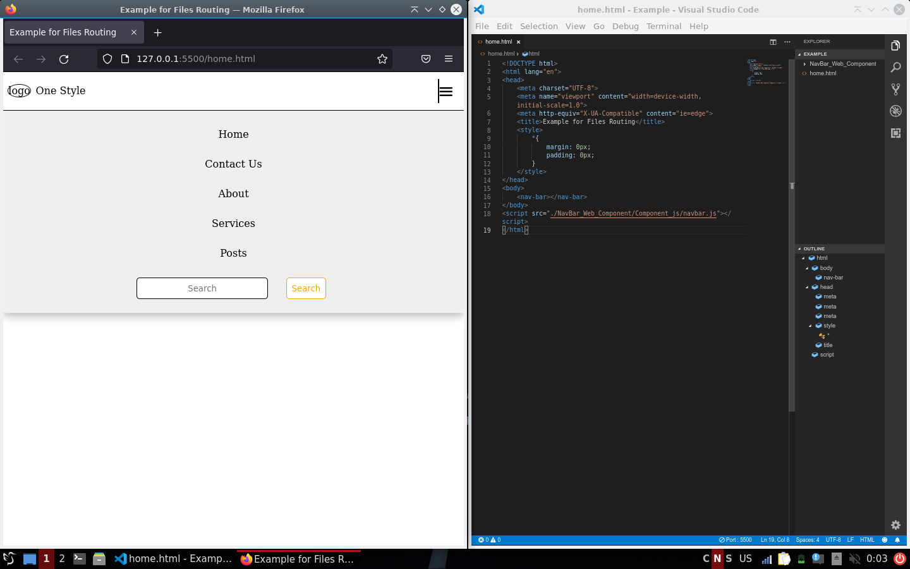
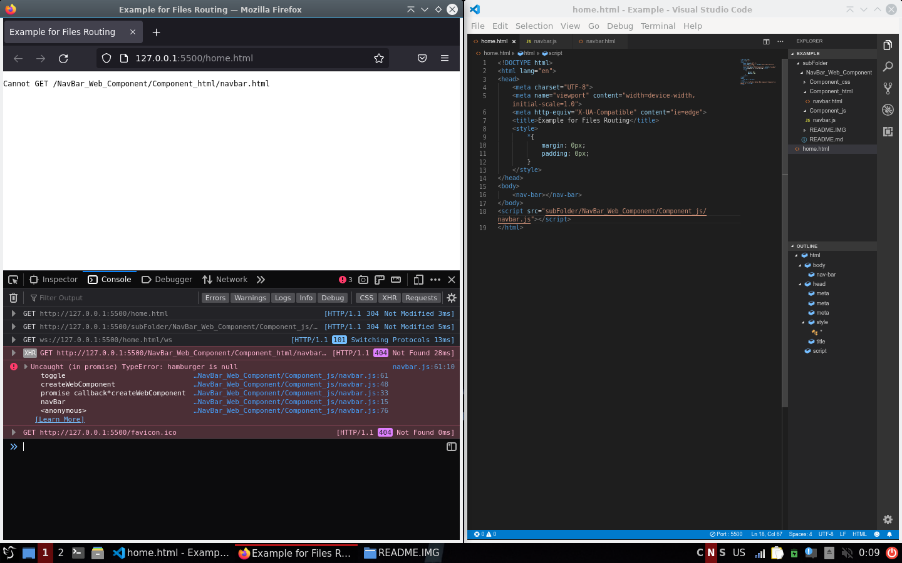
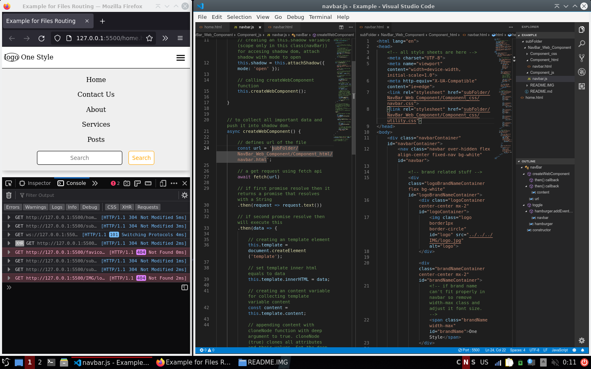

# A **NavBar** Web Component in pure **JS**.

> - The only thing is needed a **local server**. example **live server** extension in VS code
> - You have configure files routing according your need. example
>> - suppose you have home.html file and NavBar_Web_Component folder in a same directory then you don't have to do anything
 
>> - But if your NavBar_Web_Component in a subfolder then it will not working

then you have to add subfolder name in navbar.html link tag and navbar.js createWebComponent function url variable

>> - This is same if your home.html file in NavBar_Web_Component folder then just remove folder name only in navbar.html and navbar.js
> - You can use this web component in your projects freely.
> - Just copy **This** folder, and add **navbar.js** in your project.
> - All you have to use **`<nav-bar></nav-bar>`** tag in your **html** file.
> - If you find any bug please report it on github or email me on this **"yashlodhi2006@gmail.com"** account.